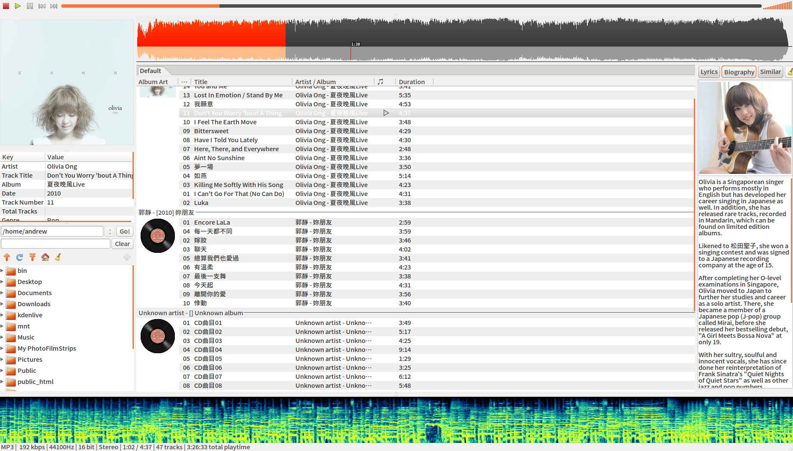
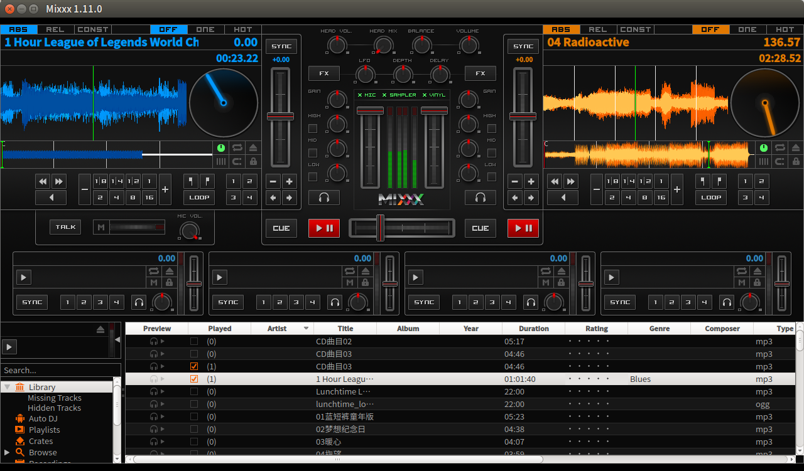
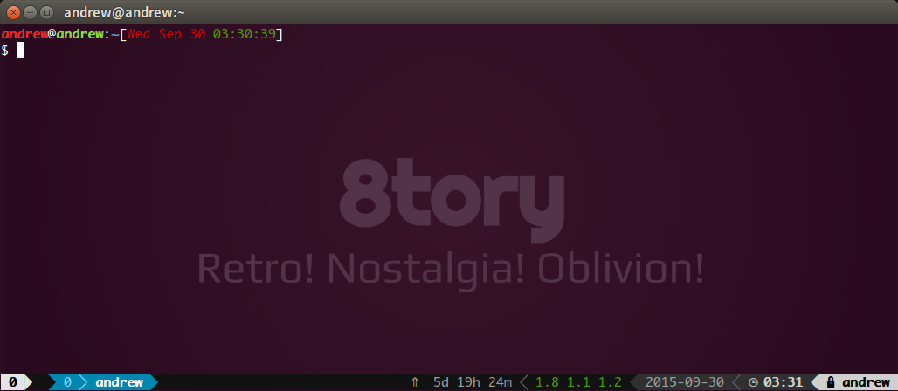
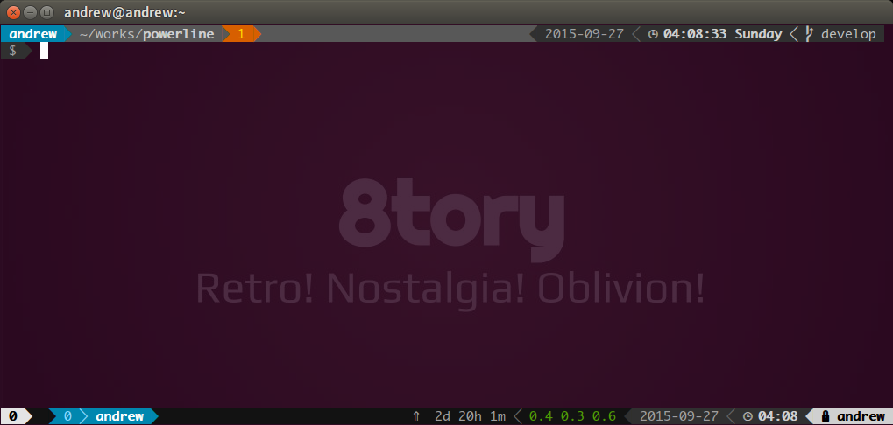
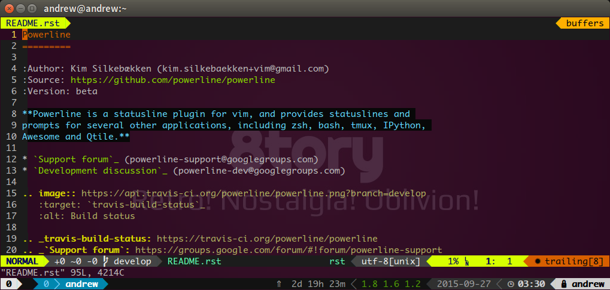

# yongjhih's rc/dotfiles

## Deadbeef



According plugins: https://github.com/yongjhih/deadbeef-plugins

```sh
git clone git@github.com:yongjhih/deadbeef-plugins.git

mv deadbeef-plugins ~/.local/lib/deadbeef
```

## nulloy
## mixxx



## bash



## fish powerline



## tmux powerline


## atom vim

## vim nvim powerling/airline



## audacity
